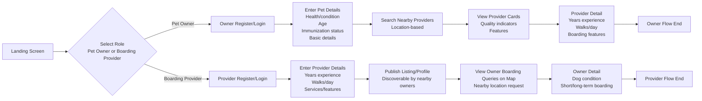

# 宠物家庭寄养信息平台 PRD

## 📑 Table of Contents
- [一、产品概述](#一产品概述)
- [二、核心场景与用户故事](#二核心场景与用户故事)
- [三、信息架构（IA）](#三信息架构ia)
- [四、主要功能与流程说明](#四主要功能与流程说明)
- [五、UI 与交互规范（TDesign Weixin）](#五ui-与交互规范tdesign-weixin)
- [六、信息匹配与位置服务](#六信息匹配与位置服务)
- [七、信息发布与联系对接](#七信息发布与联系对接)
- [八、数据与存储设计](#八数据与存储设计)
- [九、权限与登录](#九权限与登录)
- [十、性能与非功能性要求](#十性能与非功能性要求)
- [十一、埋点与指标](#十一埋点与指标)
- [十二、测试与验收要点](#十二测试与验收要点)
- [十三、技术实现要点](#十三技术实现要点)
- [十四、页面组件清单](#十四页面组件清单)
- [十五、文案与提示](#十五文案与提示)
- [十六、后续规划](#十六后续规划)

---

## 一、产品概述

- **产品名称**：宠物家庭寄养信息平台（WeChat Mini Program）
- **一句话定位**：帮助宠物主人与附近家庭寄养服务提供者完成信息发现、资料查看与联系方式对接。
- **产品边界**：平台只做信息展示、搜索匹配、联系方式对接与信息查看权益售卖。平台不做宠物寄养服务交易、不做线上接单、不代收寄养服务费用、不托管寄养资金、不承诺服务履约结果。
- **收费模式**：宠主可免费查看 3 个寄养家庭的完整信息；寄养家庭可免费查看 3 个宠物主的完整信息。超出免费额度后，用户可购买信息查看权益，价格为 **8 元 / 天**。
- **目标用户**：
  1. **宠物主人 Pet Owner**：有短期或长期家庭寄养需求，希望快速找到附近、条件合适、可信度较高的寄养家庭。
  2. **家庭寄养提供者 Boarding Provider**：具备照看宠物的时间、空间与经验，希望发布个人寄养资料，被附近宠主发现并联系。
- **核心价值**：
  1. 降低宠主寻找家庭寄养的搜索成本。
  2. 让寄养家庭通过结构化资料展示经验、服务特点与可接待条件。
  3. 基于位置、宠物信息与服务条件进行高效信息对接。
  4. 通过资料完整度、标签、审核与举报机制提升信息可信度。
  5. 通过“免费查看 3 条 + 8 元 / 天查看更多”的轻量付费模式支持平台商业化。

### 1.1 MVP 范围

MVP 重点实现“角色选择—资料填写—附近发现—详情查看—联系对接”的闭环。

- 宠主端：注册/登录、填写宠物信息、搜索附近寄养家庭、查看服务者卡片、免费查看 3 个寄养家庭完整信息、超出后购买 8 元 / 天查看权益、联系对方、收藏、举报。
- 寄养家庭端：注册/登录、填写寄养服务资料、发布/下架个人资料、查看附近宠主寄养需求、免费查看 3 个宠物主完整信息、超出后购买 8 元 / 天查看权益、联系对方、收藏、举报。
- 平台端：基础审核、资料管理、举报处理、敏感内容拦截、免费额度管理、信息查看权益管理、微信支付回调、数据统计。

### 1.2 非 MVP 范围

以下能力不在首版开发范围内：

- 宠物寄养服务的在线支付、订金、尾款、退款。
- 宠物寄养服务的在线接单、抢单、派单、订单状态流转。
- 宠物寄养服务的担保、保险、合同签署。
- 评价结算体系、服务纠纷仲裁。
- 站内聊天、留言、评论、在线接单沟通系统。首版仅展示用户主动公开的联系方式，并记录必要的信息查看、支付权益与联系行为用于风控与统计。

---

## 二、核心场景与用户故事

<details>
<summary>展开查看</summary>

### 2.1 宠主场景

1. **角色选择**：用户进入 Landing Screen 后选择“我是宠物主人”。
2. **注册/登录**：宠主通过微信授权登录，补充头像、昵称、联系方式。
3. **填写宠物信息**：填写宠物种类、年龄、健康状况、免疫状态、性格、是否绝育、饮食习惯、特殊照护要求。
4. **查找附近寄养家庭**：基于当前位置或手动选择地址，浏览附近寄养家庭。
5. **查看寄养家庭卡片**：卡片展示经验年限、可服务宠物类型、遛狗次数、可接待数量、服务标签、距离、资料完整度等信息。
6. **免费查看权益**：宠主可免费查看 3 个寄养家庭的完整信息。
7. **付费查看更多**：超出免费额度后，宠主需购买 8 元 / 天的信息查看权益，购买后可在权益有效期内查看更多寄养家庭完整信息。
8. **查看服务者详情**：进入详情页查看寄养环境、服务说明、照片、服务特点、联系方式。
9. **线下沟通**：宠主通过电话、微信复制等方式联系寄养家庭，自行确认价格、时间、责任边界与服务细节。

### 2.2 寄养家庭场景

1. **角色选择**：用户进入 Landing Screen 后选择“我是寄养家庭”。
2. **注册/登录**：寄养家庭通过微信授权登录，补充个人资料与联系方式。
3. **填写服务资料**：填写经验年限、可服务宠物类型、遛狗次数、寄养环境、服务特色、可接待区域、可接待时间、价格说明文字。
4. **发布个人寄养资料**：资料通过基础校验后进入待审核或直接发布，发布后可被附近宠主发现。
5. **查看附近寄养需求**：在地图或列表中查看附近宠主发布的寄养需求。
6. **免费查看权益**：寄养家庭可免费查看 3 个宠物主的完整信息。
7. **付费查看更多**：超出免费额度后，寄养家庭需购买 8 元 / 天的信息查看权益，购买后可在权益有效期内查看更多宠物主完整信息。
8. **查看宠物详情**：查看宠物健康、年龄、免疫、短期/长期寄养需求、特殊照护要求等。
9. **线下沟通**：寄养家庭主动联系宠主，双方自行确认服务安排。

### 2.3 平台审核场景

1. 管理员查看新发布的寄养资料和宠物需求。
2. 对联系方式、图片、敏感词、夸大承诺、违规内容进行审核。
3. 对被举报内容进行下架、警告或封禁。
4. 对用户身份信息和联系方式做必要脱敏展示。

</details>

---

## 三、信息架构（IA）

<details>
<summary>展开查看</summary>

### 3.1 底部 TabBar

- **首页**：附近寄养家庭 / 附近寄养需求的信息流。
- **发布**：根据角色发布宠物寄养需求或寄养家庭资料。
- **地图**：基于位置查看附近寄养家庭或宠主需求。
- **我的**：登录状态、个人资料、宠物档案、寄养资料、收藏、设置。

### 3.2 页面结构

- Landing Screen
- 角色选择页
- 登录/授权页
- 宠主资料页
- 宠物档案编辑页
- 寄养家庭资料编辑页
- 附近寄养家庭列表页
- 附近寄养需求列表页
- 地图页
- 寄养家庭详情页
- 宠物需求详情页
- 发布成功页
- 我的页面
- 收藏列表页
- 查看权益页 / 付费开通页
- 支付结果页
- 举报页
- 管理后台页面

### 3.3 角色差异

| 模块 | 宠物主人 | 寄养家庭 |
|---|---|---|
| 首次进入 | 选择“我是宠物主人” | 选择“我是寄养家庭” |
| 资料填写 | 宠物信息、寄养需求 | 服务经验、环境、服务项目 |
| 主要浏览对象 | 附近寄养家庭 | 附近宠主需求 |
| 详情页 | 服务者详情 | 宠物需求详情 |
| 核心动作 | 联系寄养家庭 | 联系宠主 |
| 免费额度 | 免费查看 3 个寄养家庭完整信息 | 免费查看 3 个宠物主完整信息 |
| 付费权益 | 8 元 / 天查看更多寄养家庭信息 | 8 元 / 天查看更多宠物主信息 |
| 发布内容 | 宠物寄养需求 | 寄养家庭资料 |

</details>

---

## 四、主要功能与流程说明

<details>
<summary>展开查看</summary>

### 4.1 Landing Screen 与角色选择

**目标**：让用户明确以哪种身份使用平台。

**页面内容**：
- 产品说明：附近家庭寄养信息对接平台。
- 角色选择按钮：
  - 我是宠物主人
  - 我是寄养家庭
- 平台边界提示：平台仅提供信息展示与联系方式对接，具体服务由双方线下自行确认。

**交互规则**：
- 未登录用户选择角色后进入微信授权登录。
- 已登录但未选择角色的用户进入角色选择页。
- 已登录且已有角色的用户默认进入对应首页。
- 用户可在“我的—角色设置”中申请切换或增加角色。

---

### 4.2 宠主注册/登录

**目标**：完成基础身份识别和联系方式补充。

**字段**：
- 微信 openid / unionid
- 昵称
- 头像
- 手机号或微信号
- 常用位置
- 是否同意用户协议与隐私政策

**校验**：
- 联系方式至少填写一种。
- 首次使用位置服务时弹出授权说明。
- 未同意协议不得继续发布需求。

---

### 4.3 宠物信息填写

**目标**：让寄养家庭快速判断是否适合照看该宠物。

**字段**：
- 宠物名称
- 宠物类型：狗 / 猫 / 其他
- 品种
- 年龄
- 性别
- 体重
- 健康状况
- 免疫状态
- 是否绝育
- 是否驱虫
- 性格标签：胆小、亲人、怕生、活泼、安静、护食、易叫等
- 饮食习惯
- 是否需要喂药
- 是否可与其他宠物共处
- 寄养时间：短期 / 长期 / 日期范围
- 特殊说明
- 宠物照片 1–6 张

**输出**：
- 生成宠物档案。
- 宠主可选择将宠物档案发布为“寄养需求”。
- 风险提示：请线下核实身份、环境、价格、责任边界与宠物寄养状况。


---

### 4.4 搜索附近寄养家庭

**目标**：基于位置与需求条件帮助宠主找到合适的寄养家庭。

**入口**：
- 首页
- 地图页
- 宠物档案完成后的“查找附近寄养家庭”按钮

**筛选条件**：
- 距离
- 养宠年限
- 可接待宠物类型
- 可接待宠物体型
- 是否支持短期寄养
- 是否支持长期寄养
- 是否每天遛狗
- 遛狗次数
- 是否有独立空间
- 是否有其他宠物
- 是否接受未绝育宠物
- 是否支持喂药
- 资料完整度
- 最近活跃时间

**排序规则**：
- 默认排序：距离近 + 资料完整度高 + 最近活跃。
- 可选排序：距离最近、最近活跃、经验年限高、资料完整度高。

---

### 4.5 寄养家庭卡片

**目标**：让宠主在列表中快速判断是否值得进一步查看。

**卡片内容**：
- 头像 / 昵称
- 距离
- 经验年限
- 可寄养宠物类型
- 遛狗次数 / 天
- 可接待数量
- 服务标签：独立房间、有院子、可喂药、可接小型犬、可照顾猫等
- 资料完整度
- 最近活跃时间
- 免费额度 / 权益状态提示
- 联系按钮
- 收藏按钮

**状态**：
- 正常展示
- 待审核不展示
- 已下架不展示
- 被举报处理中降低推荐权重或隐藏

---

### 4.6 寄养家庭详情页

**目标**：展示完整服务资料，支持宠主线下联系。

**内容模块**：
- 基础信息：昵称、位置范围、距离、经验年限。
- 服务能力：可服务宠物类型、体型、数量、遛狗次数、服务项目。
- 寄养环境：家庭环境说明、是否有儿童、是否有其他宠物、是否有独立空间、照片。
- 照护规则：喂食、遛狗、洗澡、喂药、夜间照看、宠物共处规则。
- 可接待时间：长期可接 / 指定日期可接 / 暂不可接。
- 价格说明：仅做文字展示，平台不提供寄养服务交易、寄养服务支付或寄养服务担保。
- 联系方式：电话、微信号、复制微信、拨打电话。
- 风险提示：请线下核实身份、环境、价格、责任边界与宠物健康状况。
- 举报入口。

**查看权益规则**：
- 宠主前 3 个寄养家庭完整信息可免费查看。
- 第 4 个及以后寄养家庭完整信息需要开通 8 元 / 天的信息查看权益。
- 未开通权益时，详情页只展示基础公开信息，不展示完整服务资料和联系方式。
- 同一寄养家庭重复查看不重复扣减免费额度。

**交互规则**：
- 点击“查看完整信息 / 联系TA”前先校验免费额度或付费权益。
- 点击“联系TA”前弹出平台边界提示。
- 联系方式可设置为登录后展示，并受免费额度或付费权益限制。
- 联系行为记录到 contact_logs。

---

### 4.7 寄养家庭注册/登录

**目标**：寄养服务者完成身份、联系方式与服务资料初始化。

**字段**：
- 微信 openid / unionid
- 昵称
- 头像
- 手机号或微信号
- 常用位置
- 可服务区域
- 是否同意用户协议与信息发布规范

**校验**：
- 联系方式至少填写一种。
- 发布资料前必须完成必要字段。
- 位置授权可选，但不授权时只能手动选择区域。

---

### 4.8 寄养家庭资料填写

**目标**：让服务者通过标准化资料展示服务能力。

**字段**：
- 经验年限
- 可接待宠物类型
- 可接待体型
- 最大接待数量
- 每日遛狗次数
- 是否有独立房间
- 是否有院子
- 是否有其他宠物
- 是否有儿童
- 是否支持喂药
- 是否支持接送
- 可服务时间
- 服务特色
- 家庭环境照片 1–9 张
- 位置范围
- 价格说明文字
- 联系方式

**资料完整度计算**：
- 基础资料 30%
- 服务能力 25%
- 环境照片 25%
- 联系方式 10%
- 可服务时间 10%

---

### 4.9 发布寄养家庭资料

**目标**：让寄养家庭被附近宠主发现。

**发布流程**：
1. 填写服务资料。
2. 系统校验必要字段。
3. 提交发布。
4. 进入审核或直接发布。
5. 发布成功后出现在附近寄养家庭列表与地图。

**发布状态**：
- draft：草稿
- pending_review：待审核
- published：已发布
- rejected：审核未通过
- hidden：用户下架
- banned：平台下架

---

### 4.10 查看附近宠主寄养需求

**目标**：寄养家庭可主动发现附近宠主的寄养需求。

**展示方式**：
- 地图点位：显示附近需求数量与大致区域。
- 列表：按距离、时间、宠物类型展示。

**需求卡片内容**：
- 宠物类型与品种
- 年龄 / 体重
- 健康与免疫状态
- 短期或长期寄养
- 期望寄养时间
- 距离
- 特殊要求
- 免费额度 / 权益状态提示
- 联系宠主按钮

**隐私规则**：
- 地图只展示模糊位置，不展示精确门牌。
- 宠主联系方式默认登录后可见。
- 未经宠主填写的信息不强行展示。

---

### 4.11 宠物需求详情页

**目标**：帮助寄养家庭判断是否适合承接照护沟通。

**内容模块**：
- 宠物基础信息
- 健康状况
- 免疫状态
- 年龄、体重、性格
- 寄养类型：短期 / 长期
- 寄养日期范围
- 特殊照护要求
- 宠物照片
- 宠主大致位置
- 联系宠主按钮
- 举报入口

**查看权益规则**：
- 寄养家庭前 3 个宠物主完整信息可免费查看。
- 第 4 个及以后宠物主完整信息需要开通 8 元 / 天的信息查看权益。
- 未开通权益时，详情页只展示基础公开信息，不展示完整宠物需求资料和联系方式。
- 同一宠物主需求重复查看不重复扣减免费额度。

---

### 4.12 我的页面

**未登录态**：
- 登录按钮
- 平台功能预览
- 用户协议与隐私政策

**宠主已登录态**：
- 我的宠物档案
- 我的寄养需求
- 我的收藏
- 查看权益与剩余免费次数
- 联系过的对象
- 举报记录
- 设置

**寄养家庭已登录态**：
- 我的寄养资料
- 发布状态
- 附近宠主需求
- 我的收藏
- 查看权益与剩余免费次数
- 联系过的对象
- 举报记录
- 设置

</details>

---

## 五、UI 与交互规范（TDesign Weixin）

- 使用 **TDesign Weixin**：Button、Form、Input、Textarea、Picker、Upload、Card、Tag、Tabs、Toast、Dialog、Skeleton、PullDownRefresh、List。
- 风格：清爽、可信、生活化、卡片化。
- 主色建议：温暖橙 / 柔和蓝绿，突出宠物友好感。
- 信息层级：优先展示距离、宠物类型、经验年限、服务标签、联系按钮。
- 表单设计：长表单拆分为步骤式填写，避免一次性信息过载。
- 状态反馈：发布成功、审核中、联系方式复制成功、举报提交成功需要 Toast 或 Dialog。
- 安全提示：涉及线下联系、价格、服务责任时使用醒目的提示条。

### 5.1 列表卡片规范

- 头像左上，昵称与距离并排。
- 标签最多展示 4 个，超出显示“+N”。
- 主 CTA：联系TA / 查看详情。
- 次 CTA：收藏 / 举报。
- 列表项点击进入详情页。

### 5.2 地图页规范

- 默认展示用户当前位置附近 3–5km 内容。
- 地图 marker 不展示精确住址。
- 点击 marker 弹出底部卡片。
- 支持切换“寄养家庭 / 寄养需求”。

---

## 六、信息匹配与位置服务

<details>
<summary>展开查看</summary>

### 6.1 匹配目标

平台不做自动派单，只提供排序和筛选，帮助用户更快发现合适对象。

### 6.2 匹配维度

| 维度 | 说明 |
|---|---|
| 位置距离 | 按用户当前位置或手动选择区域计算距离 |
| 宠物类型 | 狗、猫、其他宠物 |
| 宠物体型 | 小型、中型、大型 |
| 健康与免疫 | 是否已免疫、是否需要特殊照护 |
| 寄养周期 | 短期、长期、日期范围 |
| 服务能力 | 遛狗次数、喂药、独立空间、接送等 |
| 资料完整度 | 完整度越高排序权重越高 |
| 最近活跃 | 最近登录或更新资料的用户优先 |

### 6.3 排序公式示例

```text
score = distance_score * 0.35
      + profile_completeness_score * 0.25
      + service_match_score * 0.25
      + activity_score * 0.15
```

### 6.4 位置展示规则

- 用户授权定位后，可展示距离。
- 用户未授权定位时，支持手动选择城市/区域。
- 地图展示模糊位置，只精确到小区附近或街道范围。
- 详情页不展示完整住址，除非用户主动填写公开位置说明。

### 6.5 接口入参示例

```json
{
  "user_id": "wx_openid",
  "role": "owner",
  "location": {
    "lat": 31.2304,
    "lng": 121.4737,
    "city": "上海市"
  },
  "filters": {
    "pet_type": "dog",
    "size": "small",
    "boarding_period": "short_term",
    "need_medication": false,
    "max_distance_km": 5
  },
  "pagination": {
    "page": 1,
    "page_size": 20
  }
}
```

### 6.6 接口返回示例

```json
{
  "items": [
    {
      "provider_id": "provider_001",
      "nickname": "Sunny寄养家庭",
      "distance_km": 1.8,
      "years_experience": 3,
      "walks_per_day": 2,
      "service_tags": ["小型犬", "可喂药", "独立空间"],
      "profile_completeness": 92,
      "last_active_at": "2026-05-06T09:00:00+08:00"
    }
  ],
  "page": 1,
  "has_more": true
}
```

</details>

---

## 七、信息发布、查看权益与联系对接

<details>
<summary>展开查看</summary>

### 7.1 发布类型

1. **宠物寄养需求**：由宠主发布，供附近寄养家庭查看。
2. **寄养家庭资料**：由寄养服务者发布，供附近宠主查看。

### 7.2 可用操作

- 收藏
- 查看完整信息
- 联系TA
- 复制微信号
- 拨打电话
- 开通信息查看权益
- 举报
- 分享给微信好友

### 7.3 免费查看额度与付费规则

**规则定义**：

| 用户角色 | 免费可查看对象 | 免费额度 | 超出后收费 | 权益有效期 |
|---|---|---:|---:|---|
| 宠物主人 | 寄养家庭完整信息 | 3 个 | 8 元 / 天 | 支付成功后 24 小时 |
| 寄养家庭 | 宠物主完整信息 | 3 个 | 8 元 / 天 | 支付成功后 24 小时 |

**完整信息范围**：
- 对宠主而言，完整信息包括寄养家庭详情、环境照片、完整服务说明、可接待规则、价格说明文字和用户允许公开的联系方式。
- 对寄养家庭而言，完整信息包括宠物主需求详情、宠物照片、健康/免疫/特殊照护信息、寄养时间、宠主大致位置和用户允许公开的联系方式。

**免费额度规则**：
- 每个角色可免费查看 3 个不同对象的完整信息。
- 列表卡片、基础公开信息、筛选和地图浏览不消耗免费额度。
- 同一对象重复查看不重复消耗免费额度。
- 免费额度按角色分别计算。用户同时作为宠主和寄养家庭时，两个角色的免费额度互不共享。
- 免费额度用完后，用户仍可浏览列表卡片，但查看完整信息或联系方式时需开通信息查看权益。

**付费权益规则**：
- 信息查看权益价格为 **8 元 / 天**。
- “1 天”按支付成功后的 **24 小时**计算。
- 权益有效期内，用户可查看更多对应角色下的完整信息。为防止爬取和滥用，平台可设置合理安全上限，例如每日最多查看 100 个不同对象。
- 宠主购买的权益仅用于查看更多寄养家庭完整信息。
- 寄养家庭购买的权益仅用于查看更多宠物主完整信息。
- 付费权益仅为平台信息查看权益，不代表寄养服务交易、接单、预订、担保或保险。

**支付与退款边界**：
- 支付方式：微信支付。
- 支付对象：平台信息查看权益。
- 平台不代收寄养服务费用，不处理寄养服务订金、尾款或退款。
- 信息权益属于即时开通的数字服务，支付成功并开通后原则上不支持无理由退款。因系统故障导致权益未开通时，应支持人工核验和补开或退款。

### 7.4 联系机制

**首版建议**：联系方式展示 + 必要联系行为记录。

- 用户点击“联系TA”后，系统先校验免费额度或付费权益，再弹出风险提示。
- 用户确认后展示对方联系方式。
- 系统记录一次联系行为，但不记录双方线下沟通内容。
- 平台不生成订单，不生成交易状态，不判断服务是否达成。

### 7.5 不提供站内沟通

首版不提供站内聊天、留言、评论或私信功能。平台只负责展示用户主动填写并允许公开的联系方式。双方沟通、价格确认、寄养安排与责任边界均在线下自行完成。

**限制**：
- 页面不得出现“发送消息”“留言”“私信”“在线沟通”等入口。
- 平台不得保存双方沟通内容。
- 平台只记录完整信息查看、联系方式查看、微信号复制、电话拨打按钮点击、信息查看权益购买等行为，用于统计、风控与用户安全。

### 7.6 审核与举报

**审核对象**：
- 用户昵称
- 头像
- 寄养资料
- 宠物需求
- 图片

**举报类型**：
- 虚假信息
- 联系方式无效
- 图片不实
- 价格欺诈嫌疑
- 不当内容
- 其他

**处理结果**：
- 不处理
- 内容下架
- 要求修改
- 限制发布
- 封禁账号

</details>

---

## 八、数据与存储设计

<details>
<summary>展开查看</summary>

### 8.1 users 用户表

```json
{
  "id": "user_001",
  "openid": "wx_openid",
  "unionid": "wx_unionid",
  "role": "owner|provider|both",
  "nickname": "Ray",
  "avatar_url": "cos://avatar.jpg",
  "phone": "13800000000",
  "wechat_id": "wechat123",
  "city": "上海市",
  "lat": 31.2304,
  "lng": 121.4737,
  "status": "active|banned",
  "created_at": "2026-05-06T09:00:00+08:00",
  "updated_at": "2026-05-06T09:00:00+08:00"
}
```

### 8.2 pets 宠物表

```json
{
  "id": "pet_001",
  "owner_id": "user_001",
  "name": "Lucky",
  "pet_type": "dog",
  "breed": "柯基",
  "age": 3,
  "gender": "male",
  "weight_kg": 12,
  "health_condition": "健康",
  "immunization_status": "已免疫",
  "dewormed": true,
  "neutered": true,
  "personality_tags": ["亲人", "活泼"],
  "special_needs": "无",
  "photos": ["cos://pet1.jpg"],
  "created_at": "2026-05-06T09:00:00+08:00"
}
```

### 8.3 boarding_requests 宠主寄养需求表

```json
{
  "id": "request_001",
  "owner_id": "user_001",
  "pet_id": "pet_001",
  "boarding_period": "short_term|long_term",
  "start_date": "2026-06-01",
  "end_date": "2026-06-05",
  "location_city": "上海市",
  "lat": 31.2304,
  "lng": 121.4737,
  "requirements": ["每天遛狗2次", "不可与大型犬同住"],
  "description": "希望找附近家庭寄养",
  "status": "draft|pending_review|published|hidden|expired|banned",
  "created_at": "2026-05-06T09:00:00+08:00"
}
```

### 8.4 provider_profiles 寄养家庭资料表

```json
{
  "id": "provider_001",
  "user_id": "user_002",
  "years_experience": 3,
  "pet_types": ["dog", "cat"],
  "accepted_sizes": ["small", "medium"],
  "max_pets": 2,
  "walks_per_day": 2,
  "has_private_room": true,
  "has_yard": false,
  "has_other_pets": true,
  "has_children": false,
  "supports_medication": true,
  "supports_pickup": false,
  "service_tags": ["小型犬", "可喂药", "独立空间"],
  "environment_photos": ["cos://room1.jpg"],
  "price_description": "价格线下沟通确认，平台不收款",
  "lat": 31.2304,
  "lng": 121.4737,
  "profile_completeness": 92,
  "status": "draft|pending_review|published|hidden|rejected|banned",
  "created_at": "2026-05-06T09:00:00+08:00"
}
```

### 8.5 contact_logs 联系行为记录表

```json
{
  "id": "contact_001",
  "from_user_id": "user_001",
  "to_user_id": "user_002",
  "target_type": "provider_profile|boarding_request",
  "target_id": "provider_001",
  "contact_method": "phone|wechat",
  "created_at": "2026-05-06T09:00:00+08:00"
}
```

### 8.6 profile_view_logs 完整信息查看记录表

```json
{
  "id": "view_001",
  "viewer_id": "user_001",
  "viewer_role": "owner|provider",
  "target_type": "provider_profile|boarding_request",
  "target_id": "provider_001",
  "is_free_quota_used": true,
  "is_paid_entitlement_used": false,
  "created_at": "2026-05-06T09:00:00+08:00"
}
```

### 8.7 view_entitlements 信息查看权益表

```json
{
  "id": "entitlement_001",
  "user_id": "user_001",
  "role": "owner|provider",
  "entitlement_type": "daily_view_pass",
  "price_cents": 800,
  "currency": "CNY",
  "starts_at": "2026-05-06T09:00:00+08:00",
  "expires_at": "2026-05-07T09:00:00+08:00",
  "status": "active|expired|refunded|cancelled",
  "created_at": "2026-05-06T09:00:00+08:00"
}
```

### 8.8 payment_orders 平台权益支付订单表

```json
{
  "id": "pay_001",
  "user_id": "user_001",
  "role": "owner",
  "product_type": "daily_view_pass",
  "amount_cents": 800,
  "currency": "CNY",
  "payment_channel": "wechat_pay",
  "payment_status": "pending|paid|failed|refunded",
  "transaction_id": "wx_txn_001",
  "paid_at": "2026-05-06T09:01:00+08:00",
  "created_at": "2026-05-06T09:00:00+08:00"
}
```

### 8.9 favorites 收藏表

```json
{
  "id": "favorite_001",
  "user_id": "user_001",
  "target_type": "provider_profile|boarding_request",
  "target_id": "provider_001",
  "created_at": "2026-05-06T09:00:00+08:00"
}
```

### 8.10 reports 举报表

```json
{
  "id": "report_001",
  "reporter_id": "user_001",
  "target_type": "user|provider_profile|boarding_request",
  "target_id": "provider_001",
  "reason": "虚假信息",
  "description": "照片与实际不符",
  "status": "pending|resolved|rejected",
  "created_at": "2026-05-06T09:00:00+08:00"
}
```

</details>

---

## 九、权限与登录

<details>
<summary>展开查看</summary>

### 9.1 登录权限

- 微信授权登录为基础登录方式。
- 游客可浏览部分公开信息。
- 查看完整信息、查看联系方式、发布资料、收藏、举报必须登录。平台不提供站内聊天或留言权限。
- 用户免费额度用尽且未开通有效查看权益时，不得查看新的完整信息或联系方式。

### 9.2 位置权限

- 首次进入附近列表或地图页时请求位置授权。
- 用户拒绝授权时，提供手动选择城市/区域能力。
- 位置仅用于附近排序和距离展示。

### 9.3 图片权限

- 上传宠物照片和家庭环境照片时请求相册或拍摄权限。
- 图片上传后存储到对象存储。
- 图片需进行格式、大小、数量限制。

### 9.4 支付权限

- 信息查看权益通过微信支付完成。
- 支付仅用于平台信息查看权益，不得与寄养服务费用混同。
- 支付成功后由后端根据微信支付回调开通 24 小时查看权益。
- 前端不得仅凭本地支付状态开通权益，必须以后端权益状态为准。

### 9.5 数据隐私

- 不公开用户完整手机号。
- 微信号可由用户选择是否公开。
- 地图不展示精确住址。
- 支持用户删除宠物档案、寄养资料和寄养需求。

</details>

---

## 十、性能与非功能性要求

- 首页首屏加载时间 ≤ 2 秒。
- 列表分页加载，每页默认 20 条。
- 图片使用压缩与 CDN 加速。
- 地图页 marker 聚合，避免一次性渲染过多点位。
- 表单草稿自动保存。
- 网络异常时保留用户已填写内容。
- 重要操作需 Toast / Dialog 反馈。
- 接口异常时展示可理解的错误提示。
- 系统需支持内容审核、敏感词过滤、举报处理。
- 平台边界提示必须在联系前明确展示。
- 免费额度扣减必须原子化，避免重复点击导致多次扣减。
- 同一对象重复查看不得重复扣减免费额度。
- 支付回调必须幂等处理，避免重复开通权益。
- 付费权益到期后，系统应自动恢复免费额度 / 付费拦截规则。

---

## 十一、埋点与指标

<details>
<summary>展开查看</summary>

### 11.1 核心转化漏斗

#### 宠主端

1. 进入 Landing Screen
2. 选择宠主角色
3. 完成登录
4. 完成宠物档案
5. 搜索附近寄养家庭
6. 点击寄养家庭卡片
7. 查看完整信息
8. 免费额度用完
9. 触发付费弹窗
10. 开通 8 元 / 天查看权益
11. 点击联系方式
12. 收藏或查看联系方式

#### 寄养家庭端

1. 进入 Landing Screen
2. 选择寄养家庭角色
3. 完成登录
4. 完成寄养资料
5. 发布资料
6. 被宠主曝光
7. 被宠主点击
8. 宠主查看完整信息
9. 宠主触发付费或联系行为
10. 被宠主联系

### 11.2 关键指标

- DAU / WAU
- 新用户角色选择比例
- 宠物档案完成率
- 寄养资料完成率
- 发布成功率
- 审核通过率
- 列表曝光量
- 卡片点击率
- 详情页停留时长
- 联系按钮点击率
- 免费额度使用率
- 付费弹窗触发率
- 8 元 / 天权益购买转化率
- 付费权益复购率
- ARPPU / ARPU
- 收藏率
- 举报率
- 用户次日留存

### 11.3 埋点事件

| 事件名 | 触发时机 | 关键参数 |
|---|---|---|
| view_landing | 进入首页 | user_id, source |
| select_role | 选择角色 | role |
| complete_pet_profile | 完成宠物资料 | pet_type, completeness |
| complete_provider_profile | 完成寄养资料 | completeness |
| search_nearby | 搜索附近信息 | role, filters, city |
| view_card | 卡片曝光 | target_type, target_id |
| click_card | 点击卡片 | target_type, target_id |
| view_full_info | 查看完整信息 | viewer_role, target_type, target_id, quota_type |
| free_quota_used | 消耗免费额度 | viewer_role, remaining_free_count |
| show_paywall | 免费额度用完后展示付费弹窗 | viewer_role, target_type |
| create_view_pass_order | 创建 8 元 / 天权益支付订单 | viewer_role, amount |
| pay_view_pass_success | 信息查看权益支付成功 | viewer_role, amount, expires_at |
| click_contact | 点击联系 | contact_method, target_type |
| create_favorite | 收藏 | target_type, target_id |
| submit_report | 举报 | reason, target_type |

</details>

---

## 十二、测试与验收要点

<details>
<summary>展开查看</summary>

### 12.1 宠主流程验收

- 能从 Landing Screen 选择宠主角色。
- 能完成登录与联系方式补充。
- 能创建宠物档案。
- 能发布宠物寄养需求。
- 能基于位置搜索附近寄养家庭。
- 能查看寄养家庭卡片与详情。
- 前 3 个寄养家庭完整信息可免费查看。
- 第 4 个寄养家庭完整信息触发 8 元 / 天付费提示。
- 支付成功后 24 小时内可查看更多寄养家庭完整信息。
- 能点击联系按钮并看到平台边界提示。
- 能收藏和举报寄养家庭资料。

### 12.2 寄养家庭流程验收

- 能从 Landing Screen 选择寄养家庭角色。
- 能完成登录与联系方式补充。
- 能填写服务资料。
- 能发布、编辑、下架寄养家庭资料。
- 能查看附近宠主需求。
- 能查看宠物详情。
- 前 3 个宠物主完整信息可免费查看。
- 第 4 个宠物主完整信息触发 8 元 / 天付费提示。
- 支付成功后 24 小时内可查看更多宠物主完整信息。
- 能点击联系按钮并看到平台边界提示。
- 能收藏和举报宠主需求。

### 12.3 边界规则验收

- 平台不得出现宠物寄养服务层面的“下单”“接单”“支付”“退款”“订单完成”等交易状态入口。平台只能出现“信息查看权益支付”相关入口。
- 点击联系前必须展示“平台仅提供信息对接”的提示。
- 用户未登录不得查看完整信息和联系方式。
- 地图不得展示精确住址。
- 被下架或审核未通过内容不得出现在公开列表。
- 免费额度用尽且未开通查看权益时，不得展示新的完整信息和联系方式。
- 同一对象重复查看不应重复扣减免费额度。
- 宠主权益不得用于查看宠物主需求，寄养家庭权益不得用于查看寄养家庭资料。
- 付费权益过期后，系统应重新拦截新的完整信息查看。

### 12.4 异常场景验收

- 拒绝定位后可手动选择区域。
- 上传图片失败后可重试。
- 表单未完成时不可发布。
- 联系方式缺失时提示用户补充。
- 举报提交后可在记录中查看处理状态。

</details>

---

## 十三、技术实现要点

<details>
<summary>展开查看</summary>

### 13.1 前端

- 微信小程序原生开发或 Taro / uni-app。
- UI 组件采用 TDesign Weixin。
- 使用分包加载：地图、发布表单、管理后台可独立分包。
- 图片上传前端压缩。
- 表单草稿使用本地缓存 + 后端草稿同步。

### 13.2 后端

- 用户系统：微信 openid / unionid。
- 内容系统：宠物档案、寄养需求、寄养家庭资料。
- 搜索系统：基于城市、经纬度、标签、状态筛选。
- 联系系统：记录联系方式查看、微信号复制、电话拨打等外部联系行为。
- 权益系统：管理免费查看额度、完整信息查看记录、8 元 / 天付费查看权益。
- 支付系统：接入微信支付，仅用于平台信息查看权益，不用于寄养服务交易。
- 审核系统：敏感词、图片审核、人工审核。
- 风控系统：频繁查看联系方式、频繁举报、重复发布识别。

### 13.3 推荐技术栈

- 前端：微信小程序 + TDesign Weixin。
- 后端：Node.js / NestJS 或 Java Spring Boot。
- 数据库：MySQL / PostgreSQL。
- 缓存：Redis。
- 对象存储：腾讯云 COS / 阿里云 OSS。
- 地图服务：腾讯位置服务。
- 支付服务：微信支付。
- 内容审核：微信内容安全接口或云厂商内容安全服务。

### 13.4 API 清单

| API | 方法 | 说明 |
|---|---|---|
| /auth/wx-login | POST | 微信登录 |
| /users/me | GET | 获取当前用户信息 |
| /users/me | PUT | 更新当前用户信息 |
| /pets | POST | 创建宠物档案 |
| /pets/{id} | PUT | 更新宠物档案 |
| /boarding-requests | POST | 发布宠物寄养需求 |
| /boarding-requests/nearby | GET | 查询附近宠主需求 |
| /provider-profiles | POST | 创建寄养家庭资料 |
| /provider-profiles/{id} | PUT | 更新寄养家庭资料 |
| /provider-profiles/nearby | GET | 查询附近寄养家庭 |
| /view-entitlements/status | GET | 查询当前角色免费额度与付费权益状态 |
| /profile-views/check | POST | 校验并记录完整信息查看权限 |
| /payment-orders/view-pass | POST | 创建 8 元 / 天信息查看权益支付订单 |
| /payments/wechat/callback | POST | 微信支付回调并开通查看权益 |
| /favorites | POST | 收藏 |
| /favorites/{id} | DELETE | 取消收藏 |
| /contact-logs | POST | 记录联系行为 |
| /reports | POST | 提交举报 |

</details>

---

## 十四、页面组件清单

<details>
<summary>展开查看</summary>

### 14.1 全局组件

- RoleSelector 角色选择组件
- UserAvatar 用户头像组件
- LocationPicker 位置选择组件
- TagList 标签组件
- ContactButton 联系按钮
- AccessQuotaBadge 免费额度提示组件
- PaywallDialog 付费查看弹窗
- EntitlementCard 查看权益卡片
- RiskNotice 风险提示组件
- EmptyState 空状态组件
- LoadingSkeleton 骨架屏组件
- ReportDialog 举报弹窗

### 14.2 宠主端组件

- PetProfileForm 宠物档案表单
- PetPhotoUploader 宠物照片上传
- BoardingRequestForm 寄养需求表单
- ProviderCard 寄养家庭卡片
- ProviderDetail 寄养家庭详情

### 14.3 寄养家庭端组件

- ProviderProfileForm 寄养资料表单
- EnvironmentPhotoUploader 环境照片上传
- BoardingRequestCard 宠主需求卡片
- BoardingRequestDetail 宠物需求详情

### 14.4 地图组件

- NearbyMap 附近地图
- MapMarkerCluster 点位聚合
- BottomPreviewCard 地图底部预览卡

</details>

---

## 十五、文案与提示

<details>
<summary>展开查看</summary>

### 15.1 Landing 文案

**标题**：找到附近靠谱的家庭寄养信息

**副标题**：平台只提供信息展示与联系方式对接，具体服务请双方线下自行确认。

**按钮**：
- 我是宠物主人
- 我是寄养家庭

### 15.2 免费额度提示

> 你还可以免费查看 {remaining_count} 个完整信息。查看后可直接看到对方公开的联系方式。

### 15.3 付费查看提示

> 你的免费查看次数已用完。开通 8 元 / 天信息查看权益后，可在 24 小时内查看更多完整信息。平台仅提供信息对接，不参与寄养服务交易、接单或担保。

按钮：
- 8 元开通 1 天
- 暂不开通

### 15.4 联系前提示

> 平台仅提供信息对接，不参与定价、交易、接单或服务履约。请在线下沟通时核实对方身份、寄养环境、宠物健康情况、费用、时间与责任边界。

按钮：
- 我已了解，继续联系
- 取消

### 15.5 发布成功提示

> 发布成功。你的信息将展示给附近用户。请保持联系方式有效，并及时更新资料状态。

### 15.6 审核中提示

> 资料已提交。平台将进行基础审核，审核通过后即可展示给附近用户。

### 15.7 无定位提示

> 开启定位后，可以看到附近的寄养家庭和寄养需求。你也可以手动选择城市或区域。

### 15.8 平台边界声明

> 本平台不是宠物寄养交易平台。除平台信息查看权益付费外，平台不提供寄养服务的线上接单、支付、担保、保险或纠纷仲裁服务。用户应自行判断信息真实性，并自行承担线下沟通与服务安排的相关风险。

</details>

---

## 十六、后续规划

<details>
<summary>展开查看</summary>

### 16.1 V1.1 付费权益优化

- 查看权益到期提醒
- 权益剩余时间展示
- 多天权益包，例如 3 天、7 天
- 老用户优惠券
- 异常支付自动补偿机制

### 16.2 V1.2 信息可信度增强

- 身份认证标识
- 宠物疫苗证明上传
- 家庭环境视频展示
- 资料完整度等级
- 最近活跃标签

### 16.3 V1.3 更强筛选与匹配

- 多宠物家庭筛选
- 猫狗分区筛选
- 特殊照护筛选
- 长期寄养专区
- 节假日寄养专区

### 16.4 V1.4 社区内容

- 寄养经验分享
- 宠物照护知识卡片
- 家庭寄养注意事项
- 宠主沟通 checklist

### 16.5 仍不建议过早加入的功能

- 宠物寄养服务在线交易
- 平台派单
- 抢单系统
- 站内聊天 / 私信 / 留言
- 评价分数强排序

这些功能会显著增加合规、客服、纠纷与运营成本，不适合作为信息对接平台的早期重点。

</details>

---

## 附录 A：用户流程图文本版



---

## 附录 B：首版开发优先级

| 优先级 | 功能 | 说明 |
|---|---|---|
| P0 | 角色选择 | 决定后续流程 |
| P0 | 微信登录 | 所有发布与联系能力基础 |
| P0 | 宠物档案 | 宠主核心信息 |
| P0 | 寄养家庭资料 | 服务者核心信息 |
| P0 | 附近列表 | 信息发现核心入口 |
| P0 | 详情页 | 信息判断核心页面 |
| P0 | 免费查看额度 | 双方各免费查看 3 个完整信息 |
| P0 | 8 元 / 天查看权益 | 免费额度用完后的商业化闭环 |
| P0 | 微信支付接入 | 仅用于平台信息查看权益 |
| P0 | 联系方式展示 | 信息对接闭环 |
| P0 | 平台边界提示 | 明确非交易属性 |
| P1 | 地图页 | 提升附近发现效率 |
| P1 | 收藏 | 降低二次查找成本 |
| P1 | 举报 | 基础治理能力 |
| P1 | 审核后台 | 内容安全与质量控制 |
| P2 | 资料完整度 | 提升信息质量 |
| P2 | 分享 | 拉新与传播 |
